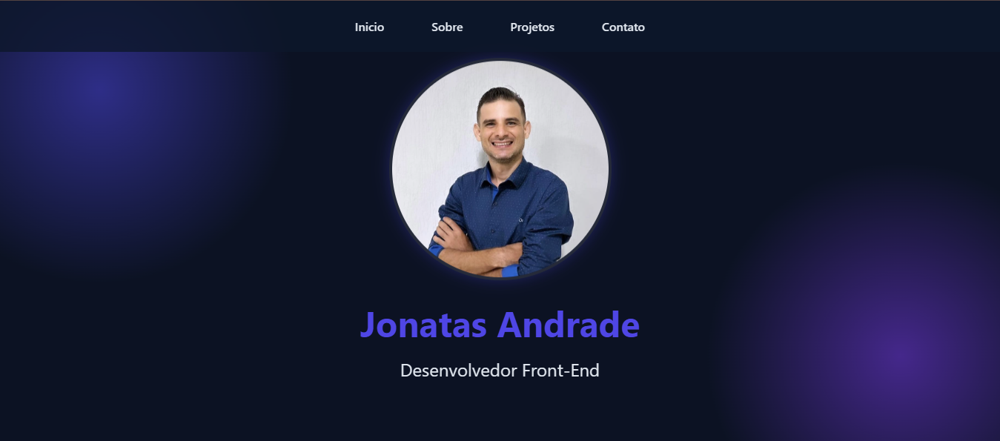

## 💻 Portfólio Pessoal

Este projeto consiste em um portfólio pessoal desenvolvido para apresentar minha trajetória, informações profissionais e projetos desenvolvidos durante minha formação em programação.

A página foi construída utilizando HTML5, CSS3 e JavaScript, com foco em uma interface moderna, navegação entre seções e apresentação dos projetos de forma organizada e visualmente atrativa.

O projeto também conta com um formulário de contato integrado ao WhatsApp, permitindo que o visitante envie uma mensagem diretamente pelo aplicativo.


## 🛠️ Tecnologias utilizadas

* HTML5
* CSS3
* JavaScript
* CSS Grid
* Variáveis CSS
* Animações com CSS
* Git e GitHub


## ⚙️ Funcionalidades

* Navegação entre as seções do portfólio por meio de menu fixo.
* Rolagem suave entre as seções da página.
* Apresentação de informações pessoais e profissionais.
* Exibição de projetos em cards organizados em um layout com CSS Grid.
* Efeitos visuais de `hover` nos menus, cards e botão de contato.
* Animação de flutuação na imagem de perfil.
* Formulário de contato para envio de mensagens diretamente pelo WhatsApp.
* Interface visual com gradientes, transparências e efeitos de desfoque.


## 🚀 Como executar o projeto

1. Clone este repositório:

```bash
https://github.com/jonatasandradedev/Site-demostrativo-jonatas/tree/master?utm_source=chatgpt.com
```

2. Acesse a pasta do projeto:


## 🖥️ Preview

Confira abaixo uma prévia do projeto em funcionamento:


```bash
cd SEU-REPOSITORIO
```

3. Abra o arquivo `index.html` no navegador.

> 💡 Durante o desenvolvimento, o projeto pode ser executado utilizando a extensão **Live Server** no VS Code.


